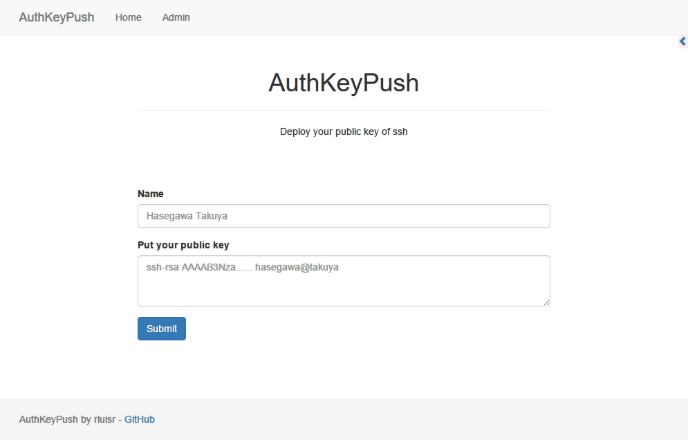
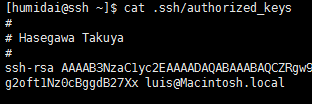

## AuthKeyPush
[](LICENSE)
[](https://codeclimate.com/github/rluisr/AuthKeyPush)  

Deploy public key to bastion server of ssh.  
- Go 1.7 => better

## Overview
1. Access `http://localhost:9000`
2. Put name and public key.
3. Submit

### Screen shot
#### Top


#### Result


## Installation
```
$ cd $GOPATH/src
$ git clone git@github.com:rluisr/AuthKeyPush.git
$ cd AuthKeyPush
$ make install
```

### First setting
Setting information for bastion server of ssh. -> **conf/ssh.json**
```
[
  {
    "host": "13.112.xx.xx",
    "user": "ec2-user",
    "port": "22",
    "key": "/path/to/secret_key"
  },
  {
    "host": "192.168.xx.xx",
    "user": "foo",
    "port": "49155",
    "password": "foobar"
  }
]
```

### Second setting
Put secret key `/path/to/secret_key`.

## Run
```
$ cd $GOPATH/src/AuthKeyPush <- IMPORTANT
$ revel run AuthKeyPush
```

### Change site message
check conf/site.json

### Enable Authentication
Only support GitHub authentication. I'll support original authentication.  
-> conf/site.json
```
{
  "title": "AuthKeyPush",
  "top-overview": "Deploy your public key of ssh",
  "auth-overview": "Login Page",
  "admin-overview": "Admin Page",
  "auth-github-login": 1,
  "github-client-id": "<clientid>",
  "github-client-secret": "<client secret>",
  "github-redirect-url": "<host>/auth/github",
  "github-allow-organization": "<Organization>"
}
```

#### GitHub
You must create OAuth application as organization is.  
<br>
**auth-github-login**  
`0`: Disable  
`1`: Enable

**github-allow-organization**  
allow organization